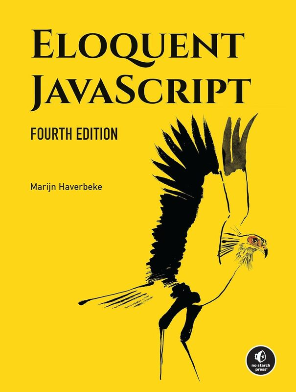

<h1 align="center">Eloquent JavaScript, 4th Edition</h1>

    

    
    
    

## Support

- [No Starch Press : Eloquent JavaScript, 4th Edition](https://eloquentjavascript.net/)

## Roadmap

- [ ] Values, Types, and Operators
- [ ] Program Structure
- [ ] Functions
- [ ] Data Structures: Objects and Arrays
- [ ] Higher-order Functions
- [ ] The Secret Life of Objects
- [ ] Bugs and Errors
- [ ] Regular Expressions
- [ ] Modules
- [ ] Asynchronous Programming
- [ ] JavaScript and the Browser
- [ ] The Document Object Model
- [ ] Handling Events
- [ ] HTTP and Forms

## License

[MIT](LICENSE.md)
